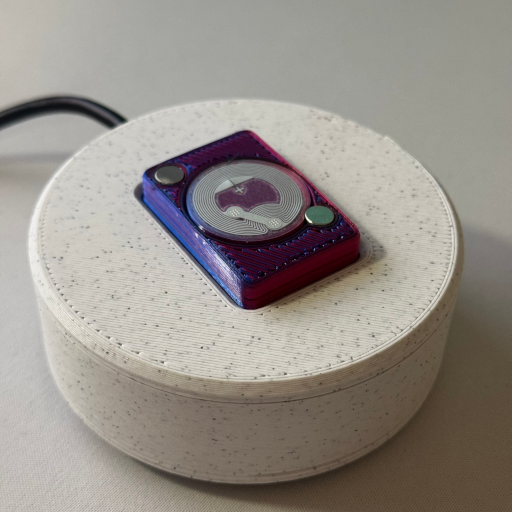

# Cartridge

Tools for creating a physical game library

## Description

Cartridge lets you launch PC games with NFC tags - without any software running on your computer.

### Features

+ Guided setup
    + Automatically generates your game list without any sign-ins
    + Automatically generates a printable library PDF, to cut and paste on your 3D printed Cartridges
    + Semi-automated NFC tag provisioning
+ Configurable Reader
    + Launch any game or executable file by placing a Cartridge on the Reader
    + Send a hotkey combination when launching SteamVR games (e.g. to launch WiGig software or power on bay-stations)
    + Option to close Steam games when a new game is launched via Cartridge
    + Option to launch a random game with a specific Cartridge
    + Stylish indicator LEDs
---
+ ***NOTE:*** Cartridge is still in development. It only works on Windows 10/11. Library image generation is limited to Steam games at the moment.
    + Upcoming features: Sound effects, Linux support (with some additional setup), optional WiFi module?

### Why?

Because it's super cool, and having a physical representation of your library makes it fun and easy to share.

## Building Source

(todo)
+ python script build
+ platformio env:teensy40
+ uploading the firmware

## Assembly

### Hardware & Materials

You will need:

+ 1x Teensy 4.0
+ 1x PN532 NFC Module
+ 1x Micro USB Cable (with functional D+/D- wires)
+ 1x FR4 Protoboard -OR- a populated PCB
+ 1x DIP Switch (3 switches, 6 pin)
+ 7x Self-tapping 2.5mm Screws
+ Neopixel Strip (3 LEDs long)
+ 3x Mini Rubber Feet
+ NTAG215 Stickers (x however many games you have)
+ 6mm by 2mm magnets (2x however many games you have)
+ Super Glue
+ Photo paper
+ Rubber cement
+ 3D Printer filament

(todo assembly instructions)